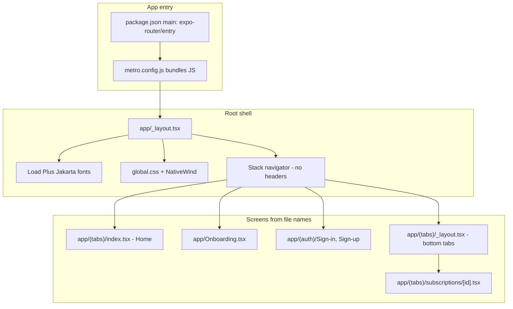
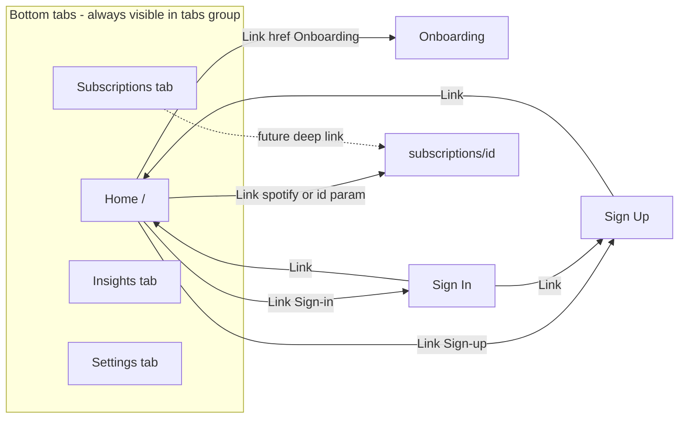
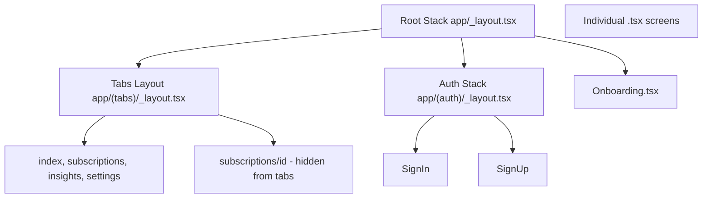
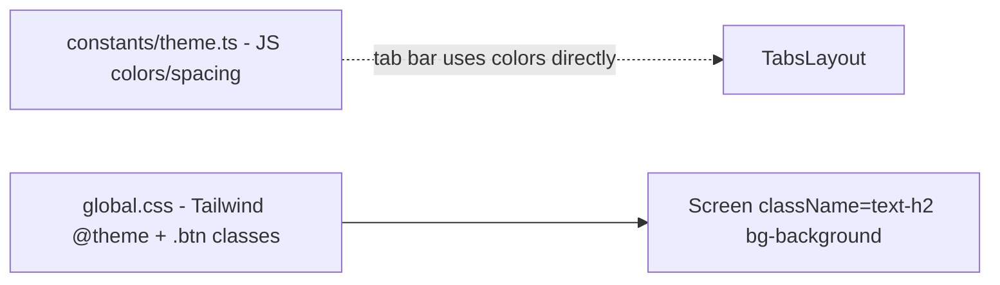
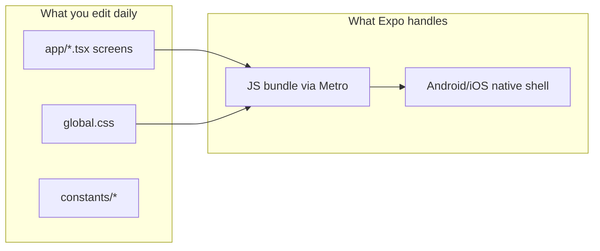

# React Native Test — Project Guide for Beginners

A simple map of this Expo + React Native app: what each important file does, how screens connect, and how that relates to Android development.

## Important: This is not “classic” Android development

You are building with **React Native + Expo**, not with Kotlin/XML in Android Studio alone.

| Native Android (traditional) | This project (React Native + Expo) |
|------------------------------|-------------------------------------|
| Kotlin or Java | **TypeScript** (`.tsx` files) |
| XML layouts | **React components** + **Tailwind-style classes** (`className="..."`) |
| Activities / Fragments | **Screens** in the `app/` folder |
| AndroidManifest navigation | **Expo Router** (file-based routes, like a website) |

When you run `npm run android`, Expo still produces a real Android app — but most UI code you edit lives in TypeScript/React, not in `MainActivity.kt`.

---

## Big picture: what happens when the app starts



1. **[package.json](../package.json)** — `"main": "expo-router/entry"` tells Expo where to start the app.
2. **[metro.config.js](../metro.config.js)** — Bundles your TypeScript/React code and wires **NativeWind** for CSS-like styling.
3. **[app/_layout.tsx](../app/_layout.tsx)** — **Root wrapper**: loads fonts, hides the splash screen, wraps everything in a **Stack** (screens can slide on top of each other).
4. **Expo Router** — Picks screens from the `app/` folder. The default home screen is `app/(tabs)/index.tsx` (route `/`).

---

## Folder map: what each part does

```
react-native-test/
├── app/                 ← ALL SCREENS (most important for you)
├── assets/              ← Images, fonts, icons (static files)
├── constants/           ← Shared data: colors, tab list, icon imports
├── global.css           ← Design tokens + reusable CSS classes
├── app.json             ← Expo app config (name, icon, Android settings)
├── package.json         ← Dependencies and npm scripts
├── metro.config.js      ← JS bundler + NativeWind
├── postcss.config.mjs   ← Tailwind CSS processing
├── tsconfig.json        ← TypeScript + @/ path alias
└── node_modules/        ← Libraries (don't edit)
```

### `app/` — screens and navigation (file = route)

Expo Router turns **file paths into URLs**:

| File | Route URL | Role |
|------|-----------|------|
| [app/_layout.tsx](../app/_layout.tsx) | (wrapper) | Root: fonts, splash, `Stack` for all top-level screens |
| [app/(tabs)/_layout.tsx](../app/(tabs)/_layout.tsx) | (wrapper) | Bottom tab bar: Home, Subscriptions, Insights, Settings |
| [app/(tabs)/index.tsx](../app/(tabs)/index.tsx) | `/` | **Home** — links to onboarding, auth, subscription detail |
| [app/(tabs)/subscriptions.tsx](../app/(tabs)/subscriptions.tsx) | `/subscriptions` | Subscriptions tab screen |
| [app/(tabs)/insights.tsx](../app/(tabs)/insights.tsx) | `/insights` | Insights tab |
| [app/(tabs)/settings.tsx](../app/(tabs)/settings.tsx) | `/settings` | Settings tab |
| [app/(tabs)/subscriptions/[id].tsx](../app/(tabs)/subscriptions/[id].tsx) | `/subscriptions/spotify` etc. | **Dynamic** detail screen; `id` comes from the URL |
| [app/Onboarding.tsx](../app/Onboarding.tsx) | `/Onboarding` | Onboarding welcome screen |
| [app/(auth)/_layout.tsx](../app/(auth)/_layout.tsx) | (wrapper) | Stack for auth screens |
| [app/(auth)/Sign-in.tsx](../app/(auth)/Sign-in.tsx) | `/(auth)/Sign-in` | Sign in |
| [app/(auth)/Sign-up.tsx](../app/(auth)/Sign-up.tsx) | `/(auth)/Sign-up` | Sign up |

**Parentheses folders** like `(tabs)` and `(auth)` are **route groups**: they organize layouts but **do not** appear in the URL. So `app/(tabs)/index.tsx` is still just `/`.

---

## Navigation flow (how users move between screens)



**How navigation is coded on the home screen** ([app/(tabs)/index.tsx](../app/(tabs)/index.tsx)):

- `<Link href="/Onboarding">` → opens onboarding
- `<Link href="/(auth)/Sign-in">` → auth stack, sign-in screen
- `<Link href="/subscriptions/spotify">` → detail with `id = "spotify"`
- `<Link href={{ pathname: "/subscriptions/[id]", params: { id: "cloude" } }}>` → same pattern, different id

**Tab bar** — [app/(tabs)/_layout.tsx](../app/(tabs)/_layout.tsx) reads tab metadata from [constants/data.ts](../constants/data.ts) and hides `subscriptions/[id]` from the tab bar (`href: null`) so the detail screen is pushed on the stack, not shown as a fifth tab.

---

## Layout hierarchy (nested navigators)

Think of nested layouts like Russian dolls:



- **Stack** (root + auth): push/pop screens (e.g. sign-in on top of home).
- **Tabs** (main app): switch between bottom icons without losing each tab’s state.

---

## Styling system (3 layers)



| File | Purpose |
|------|---------|
| [global.css](../global.css) | Tailwind v4 theme (colors, spacing, fonts), component classes (`.btn`, `.tabs-active`, etc.) |
| [constants/theme.ts](../constants/theme.ts) | Same design values in **JavaScript** (tab bar `backgroundColor`, heights) |
| [postcss.config.mjs](../postcss.config.mjs) | Runs Tailwind when CSS is processed |
| **NativeWind** | Lets you use `className="..."` on React Native `View` / `Text` |

Screens often wrap content in **SafeAreaView** so content avoids the notch and status bar on phones.

---

## Config and tooling files

| File | What it does |
|------|----------------|
| [app.json](../app.json) | App display name, icons, splash, Android adaptive icon, font plugin list |
| [package.json](../package.json) | `npm start`, `npm run android`, `npm run ios`; lists libraries |
| [tsconfig.json](../tsconfig.json) | `@/` imports map to project root (e.g. `@/constants/data`) |
| [expo-env.d.ts](../expo-env.d.ts) | TypeScript types for Expo |
| [nativewind-env.d.ts](../nativewind-env.d.ts) | Types for `className` on RN components |

---

## `constants/` — shared app data

| File | Role |
|------|------|
| [constants/data.ts](../constants/data.ts) | Tab names, titles, icons for bottom navigation |
| [constants/theme.ts](../constants/theme.ts) | `colors`, `spacing`, `components.tabBar` sizes |
| [constants/icons.ts](../constants/icons.ts) | Imports PNG icons from `assets/icons/` |
| [constants/image.ts](../constants/image.ts) | Other image assets (if used) |

---

## `assets/` — static files

- **fonts/** — Plus Jakarta Sans (loaded in root layout + registered in `app.json`)
- **icons/** — Tab and brand icons
- **images/** — App icon, splash, favicon (referenced from `app.json`)

---

## Key libraries (from package.json)

| Library | Role |
|---------|------|
| **expo** | Tooling to run/build iOS, Android, web |
| **expo-router** | File-based navigation |
| **react-native** | Core UI primitives (`View`, `Text`, `Image`) |
| **nativewind** | Tailwind classes on React Native |
| **react-native-safe-area-context** | Safe areas (notch, home indicator) |
| **react-native-reanimated** | Animations (imported in layouts) |

---

## Mental model vs Android Studio



- **You**: build UI in `.tsx`, navigate with `<Link>` and file routes.
- **Expo**: bundles JavaScript and runs on emulator or device when you use `npm run android`.

---

## Run the app on Android

1. Install dependencies: `npm install`
2. Start Metro: `npm start` or `npm run android`
3. Press `a` in the terminal for Android emulator, or scan the QR code with Expo Go on a physical device

You need [Android Studio](https://docs.expo.dev/workflow/android-studio-emulator/) with an emulator set up for the emulator path.

---

## Suggested learning order

1. Open [app/(tabs)/index.tsx](../app/(tabs)/index.tsx) — change text, add a button, watch hot reload.
2. Trace one `<Link href="...">` to its target file under `app/`.
3. Read [app/(tabs)/_layout.tsx](../app/(tabs)/_layout.tsx) and [constants/data.ts](../constants/data.ts) to see how tabs work.
4. Open [app/(tabs)/subscriptions/[id].tsx](../app/(tabs)/subscriptions/[id].tsx) and pass different `id` values from home links.
5. Tweak colors in [global.css](../global.css) `@theme` block and reload.

---

## Current app state

This repo is a **learning scaffold**: screens are mostly placeholders (“SignIn”, “subscriptions”, onboarding text). Navigation is wired (stack + tabs + dynamic route). Real auth, APIs, and subscription data are not implemented yet.

---

## Further reading

- [Expo Router docs](https://docs.expo.dev/router/introduction/)
- [React Native docs](https://reactnative.dev/docs/getting-started)
- [NativeWind docs](https://www.nativewind.dev/)
